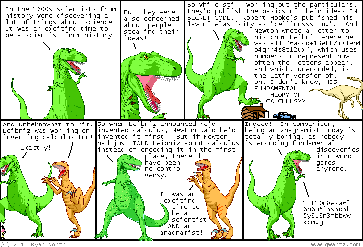

These are word lists and other things I've created to help solve the infamous anacryptogram from [Dinosaur Comics #1663](https://qwantz.com/index.php?comic=1663), aka the "Qwantzle".

## Word lists
* **[qwantzcorpus.txt](qwantzcorpus.txt)**: jadrian's list of all the words used in Dinosaur Comics as of the Qwantzle's publication.
* **[wordlist.txt](wordlist.txt)**: a filtered word list based on the following hints:
  * All the words are in the Qwantz Corpus.
  * All the words are dictionary words.
  * The letters are case-sensitive.
  * The longest word is 11 letters, and the next-longest is 8 letters.
  * The final letter of the solution is "w".
* **[longest_pairs.txt](longest_pairs.txt)**: candidates for the longest pair of words based on the hint that they are side-by-side in the solution.

## Scripts
You will need my [word search tools](https://github.com/bmjcode/word-search) to use most of these.
* **[generate_wordlist.sh](generate_wordlist.sh)**: generate wordlist.txt from qwantzcorpus.txt.
* **[generate_longest.sh](generate_longest.sh)**: generate longest\_pairs.txt from wordlist.txt.
